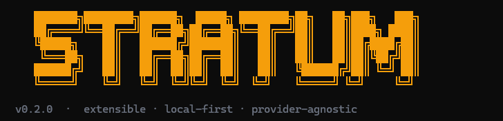

<div align="center">
  
</div>

<div align="center">

[](https://github.com/choruzo/CLI)
[](https://nodejs.org)
[](LICENSE)
[](STRATUM_PROJECT_DEFINITION.md)

**Agente CLI extensible · Provider-agnostic · Local-first**

</div>

---

Stratum es un agente de línea de comandos construido sobre un loop **ReAct** (Reason → Act → Observe) con soporte de **plan-and-execute** y arquitectura **multi-agente**. Funciona con cualquier API OpenAI-compatible: Ollama, llama.cpp, vLLM, LiteLLM y OpenAI nativo.

## ✦ Capacidades actuales

| Área | Estado | Detalle |
|---|:---:|---|
| Loop ReAct + streaming | ✅ | Iteraciones con tool calls, compresión de contexto automática |
| Provider router | ✅ | Fallback automático, health check en background, `/provider` en sesión |
| Tools built-in | ✅ | `read_file`, `write_file`, `edit_file`, `glob`, `list_directory`, `grep`, `bash`, `web_search`, `web_fetch` |
| Confirmación destructiva | ✅ | Interactiva en `chat`, readline en `run`, deny automático en CI |
| MCP Client | ✅ | Arranque lazy/eager, heartbeat, backoff, carpeta gestionada `~/.stratum/mcp/` |
| Memoria Layer 1 | ✅ | `STRATUM.md` global y de proyecto inyectado en system prompt |
| Memoria Layer 2 | ✅ | `decisions.json` — decision store estructurado con escritura atómica |
| Memoria Layer 3 | ✅ | `vectors.db` — índice semántico con `sqlite-vec` + fallback brute-force JS |
| Sesiones persistentes | ✅ | `list`, `resume`, `delete`, `prune` |
| Plan & Execute | ✅ | Modo planning en 3 fases, UI con aprobación interactiva, persistencia incremental |
| UI de terminal | ✅ | Ink + markdown, barra de estado, tool call blocks con 4 estados |

## ✦ Inicio rápido

Requiere **Node.js 22+**.

```bash
cd stratum-cli
npm install
npm run build
node dist/index.js --help
```

```bash
# Inicializa el proyecto y genera STRATUM.md
stratum init

# Modo interactivo
stratum chat

# Tarea one-shot
stratum run "Analiza ./src y resume la arquitectura"

# Modo plan-and-execute
stratum run --plan "Refactoriza el módulo de autenticación"
```

Para usar el binario directamente durante el desarrollo:

```bash
cd stratum-cli && npm link
stratum --help
```

## ✦ Configuración

`stratum init` crea una configuración mínima. También puedes escribir `.stratumrc.json` manualmente:

```json
{
  "provider": {
    "default": "local-ollama",
    "providers": {
      "local-ollama": {
        "type": "openai-compatible",
        "baseUrl": "http://localhost:11434/v1",
        "model": "qwen2.5-coder:32b",
        "apiKey": "ollama",
        "contextWindow": 32768
      }
    }
  }
}
```

> Las variables `${VAR_NAME}` se expanden desde el entorno al cargar la config.  
> El ejemplo completo está en `stratum-cli/.stratumrc.json.example`.  
> `contextWindow` debe reflejar el contexto **real** de tu servidor — un valor incorrecto puede degradar la calidad de `stratum init`.

## ✦ Comandos

```
stratum chat                            Sesión interactiva
stratum chat --resume <id>              Reanuda una sesión guardada
stratum run "<tarea>"                   Tarea one-shot
stratum run --plan "<tarea>"            Modo plan-and-execute
stratum run --allow-destructive "..."   Aprueba tools destructivas automáticamente
stratum run --deny-destructive "..."    Deniega tools destructivas automáticamente
stratum init [--force] [--dry-run]      Genera/actualiza STRATUM.md
stratum config get <clave>              Lee una clave de config
stratum config set <clave> <valor>      Escribe una clave de config
stratum sessions list [--last <n>]      Lista sesiones guardadas
stratum sessions resume <id>            Reanuda una sesión
stratum sessions delete <id>            Elimina una sesión
stratum sessions prune [--older <dur>]  Borra sesiones antiguas
stratum memory list                     Lista decisiones guardadas
stratum memory search "<query>"         Búsqueda semántica en memoria
stratum memory forget <id>              Elimina una decisión
stratum mcp list                        Lista servidores MCP configurados
stratum mcp install [server]            Instala un MCP server gestionado
stratum providers                       Lista providers configurados
stratum logs path                       Ruta al fichero de logs
stratum logs tail [n]                   Últimas N líneas del log
```

## ✦ Arquitectura

```
StratumAgent
  ├─ ReactLoop / ContextManager   loop ReAct, compresión, plan-and-execute
  ├─ ProviderRouter                fallback automático, health check
  ├─ ToolRegistry / ToolDispatcher confirmación destructiva, timeout, AbortSignal
  ├─ MemoryManager                 STRATUM.md · decisions.json · vectors.db
  ├─ SessionStore                  persistencia de conversaciones
  └─ McpManager                    servidores MCP con heartbeat y backoff
```

Directorios clave en `stratum-cli/src/`:

| Directorio | Contenido |
|---|---|
| `agent/` | Loop ReAct, eventos, compresión de contexto, plan-and-execute |
| `providers/` | `IProvider`, router con fallback, detección de capacidades |
| `tools/` | Tools built-in organizadas en `fs/`, `shell/`, `web/`, `mcp/`, `plan/` |
| `memory/` | `STRATUM.md`, `decisions.ts`, `vectors.ts`, `embeddings.ts` |
| `session/` | Persistencia de sesiones y plan store |
| `logging/` | Logger estructurado, sinks stderr/file/memory, redacción de secretos |
| `cli/` | Comandos Commander.js e interfaz Ink |

## ✦ Desarrollo

```bash
cd stratum-cli

npm run dev          # hot-reload
npm run build        # genera ESM + CJS en dist/
npm run test:run     # Vitest sin modo watch
npm run lint         # ESLint
npm run format       # Prettier
```

## ✦ Documentación

| Archivo | Descripción |
|---|---|
| `STRATUM_PROJECT_DEFINITION.md` | Visión del producto, roadmap y especificaciones vinculantes (§12 = invariantes) |
| `STRATUM_UI_SPECIFICATION.md` | Comportamiento esperado de la UI de terminal |
| `CLAUDE.md` | Guía operativa del repositorio y convenciones de implementación |
| `CLI-DOC/` | Documentación complementaria |

---

<div align="center">
  <sub>MIT License · <a href="STRATUM_PROJECT_DEFINITION.md">Roadmap completo →</a></sub>
</div>
