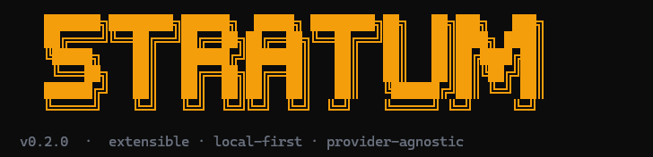

<div align="center">
  
</div>

<div align="center">

[](https://github.com/choruzo/CLI)
[](https://nodejs.org)
[](LICENSE)
[](STRATUM_PROJECT_DEFINITION.md)

**Agente CLI extensible · Provider-agnostic · Local-first**

</div>

---

Stratum es un agente de línea de comandos construido sobre un loop **ReAct** (Reason → Act → Observe) con soporte de **plan-and-execute** y arquitectura **multi-agente**. Funciona con cualquier API OpenAI-compatible: Ollama, llama.cpp, vLLM, LiteLLM y OpenAI nativo.

## ✦ Capacidades actuales

| Área | Estado | Detalle |
|---|:---:|---|
| Loop ReAct + streaming | ✅ | Iteraciones con tool calls, compresión de contexto automática |
| Provider router | ✅ | Fallback automático, health check en background, `/provider` en sesión |
| Tools built-in | ✅ | `read_file`, `write_file`, `edit_file`, `glob`, `list_directory`, `grep`, `bash`, `web_search`, `web_fetch` |
| SSH nativo | ✅ | `ssh_exec`, `ssh_upload`, `ssh_download` sobre `ssh2` — sin el binario `ssh` del sistema |
| Confirmación destructiva | ✅ | Interactiva en `chat`, readline en `run`, deny automático en CI |
| MCP Client | ✅ | Arranque lazy/eager, heartbeat, backoff, carpeta gestionada `~/.stratum/mcp/` |
| Memoria Layer 1 | ✅ | `STRATUM.md` global y de proyecto inyectado en system prompt |
| Memoria Layer 2 | ✅ | `decisions.json` — decision store estructurado con escritura atómica |
| Memoria Layer 3 | ✅ | `vectors.db` — índice semántico con `sqlite-vec` + fallback brute-force JS |
| Sesiones persistentes | ✅ | `list`, `resume`, `delete`, `prune` |
| Plan & Execute | ✅ | Modo planning en 3 fases, UI con aprobación interactiva, persistencia incremental |
| Multi-agente (subagentes) | ✅ | `delegate_task`, perfiles markdown, ejecución paralela acotada por semáforo, árbol vivo `/subagents` |
| UI de terminal | ✅ | Ink + markdown, barra de estado, tool call blocks con 4 estados, árbol de subagentes |

## ✦ Inicio rápido

Requiere **Node.js 22+**.

```bash
cd stratum-cli
npm install
npm run build
node dist/index.js --help
```

```bash
# Inicializa el proyecto y genera STRATUM.md
stratum init

# Modo interactivo
stratum chat

# Tarea one-shot
stratum run "Analiza ./src y resume la arquitectura"

# Modo plan-and-execute
stratum run --plan "Refactoriza el módulo de autenticación"
```

En `stratum chat`, el agente puede delegar subtareas a subagentes especializados (`delegate_task`) usando los perfiles definidos en `.stratum/agents/` o `~/.stratum/agents/`.

Para usar el binario directamente durante el desarrollo:

```bash
cd stratum-cli && npm link
stratum --help
```

## ✦ Configuración

`stratum init` crea una configuración mínima. También puedes escribir `.stratumrc.json` manualmente:

```json
{
  "provider": {
    "default": "local-ollama",
    "providers": {
      "local-ollama": {
        "type": "openai-compatible",
        "baseUrl": "http://localhost:11434/v1",
        "model": "qwen2.5-coder:32b",
        "apiKey": "ollama",
        "contextWindow": 32768
      }
    }
  }
}
```

> Las variables `${VAR_NAME}` se expanden desde el entorno al cargar la config.  
> El ejemplo completo está en `stratum-cli/.stratumrc.json.example`.  
> `contextWindow` debe reflejar el contexto **real** de tu servidor — un valor incorrecto puede degradar la calidad de `stratum init`.

### Perfiles de subagentes

El agente principal puede delegar subtareas con la tool `delegate_task`, que ejecuta un subagente en contexto **aislado** (sin heredar el historial del padre) usando un perfil markdown+frontmatter:

```
.stratum/agents/<perfil>.md      # perfiles de proyecto (tienen prioridad)
~/.stratum/agents/<perfil>.md    # perfiles globales
```

Hay tres perfiles de ejemplo (`research`, `code`, `shell`) además del perfil `general` embebido. `agents.maxConcurrency` en `.stratumrc.json` controla cuántos subagentes corren en paralelo (semáforo); con `1` la ejecución es estrictamente secuencial. Los subagentes no pueden delegar a su vez (profundidad = 1).

### Hosts remotos (SSH)

Stratum lleva un cliente SSH propio sobre `ssh2`: **nunca invoca el binario `ssh` del sistema**, así que funciona igual en Windows, Linux y macOS. Las tools `ssh_exec`, `ssh_upload` y `ssh_download` **solo aparecen si defines un inventario** — sin sección `ssh`, el modelo ni siquiera las ve.

```json
{
  "ssh": {
    "hosts": {
      "bastion": {
        "host": "bastion.example.com",
        "user": "javi",
        "privateKey": "~/.ssh/id_ed25519"
      },
      "prod-web": {
        "host": "192.168.1.10",
        "user": "javi",
        "privateKey": "~/.ssh/id_ed25519",
        "jumpHost": "bastion",
        "confirmAll": true
      }
    }
  }
}
```

El agente se refiere a los hosts **solo por su alias**; las credenciales nunca pasan por el modelo.

| Campo | Para qué |
|---|---|
| `privateKey` / `passphrase` / `useAgent` / `password` | Autenticación. `passphrase` y `password` aceptan `env:<VAR>` o el fallback `STRATUM_SSH_<ALIAS>_SECRET` |
| `jumpHost` | Alias de otro host como bastión (túnel TCP, profundidad máxima 2) |
| `hostKeyPolicy` | `tofu` (por defecto), `strict` con `hostKeyHash` pinneado, o `insecure` para lab |
| `confirmAll` | Pide confirmación en **todos** los comandos del host. Recomendado en producción |
| `commandTimeout` / `maxBytes` | Cortan comandos que no terminan (30 s) y salidas gigantes (256 KB) matando el proceso remoto |

**Verificación de host key.** La primera conexión muestra el fingerprint y pregunta; a partir de ahí verifica en silencio contra `~/.stratum/known_hosts.json`. Si la clave cambia, la conexión se **aborta siempre** — no hay override interactivo:

```bash
stratum ssh list                   # inventario con conectividad y latencia en vivo
stratum ssh trust prod-web         # muestra el fingerprint y pide confirmación
stratum ssh trust prod-web --force # tras reinstalar el host
```

Cada comando remoto queda registrado en `~/.stratum/logs/ssh-audit.jsonl`.

> **Sobre la detección de comandos destructivos:** es una red de seguridad blanda contra descuidos del modelo, no un control real — un `base64 -d | sh` la esquiva sin esfuerzo. La defensa de verdad en hosts de producción es `confirmAll: true`.

## ✦ Comandos

```
stratum chat                            Sesión interactiva
stratum chat --resume <id>              Reanuda una sesión guardada
stratum run "<tarea>"                   Tarea one-shot
stratum run --plan "<tarea>"            Modo plan-and-execute
stratum run --allow-destructive "..."   Aprueba tools destructivas automáticamente
stratum run --deny-destructive "..."    Deniega tools destructivas automáticamente
stratum init [--force] [--dry-run]      Genera/actualiza STRATUM.md
stratum config get <clave>              Lee una clave de config
stratum config set <clave> <valor>      Escribe una clave de config
stratum sessions list [--last <n>]      Lista sesiones guardadas
stratum sessions resume <id>            Reanuda una sesión
stratum sessions delete <id>            Elimina una sesión
stratum sessions prune [--older <dur>]  Borra sesiones antiguas
stratum memory list                     Lista decisiones guardadas
stratum memory search "<query>"         Búsqueda semántica en memoria
stratum memory forget <id>              Elimina una decisión
stratum mcp list                        Lista servidores MCP configurados
stratum mcp install [server]            Instala un MCP server gestionado
stratum providers                       Lista providers configurados
stratum ssh list                        Hosts SSH con conectividad y latencia en vivo
stratum ssh trust <alias>                Muestra el fingerprint y lo confía
stratum ssh trust <alias> --force        Reemplaza la host key almacenada
stratum ssh trust <alias> --remove       Elimina la host key almacenada
stratum logs path                       Ruta al fichero de logs
stratum logs tail [n]                   Últimas N líneas del log
```

Dentro de `stratum chat`, algunos comandos de sesión relevantes:

```
/plan <tarea>                Inicia el modo plan-and-execute
/subagents                   Inspector: lista y navega los transcripts de subagentes del turno
/provider <name>             Cambia de provider en la sesión activa
/model                       Selecciona modelo (descubre modelos en vivo si el backend expone /models)
/memory list|search|forget   Gestión de memoria de decisiones desde el chat
/tools                       Lista tools disponibles, incluidas las MCP registradas
```

## ✦ Arquitectura

```
StratumAgent
  ├─ ReactLoop / ContextManager   loop ReAct, compresión, plan-and-execute
  ├─ SubagentRouter (delegate_task) contexto aislado, semáforo de concurrencia, presupuesto
  ├─ ProviderRouter                fallback automático, health check
  ├─ ToolRegistry / ToolDispatcher confirmación destructiva, timeout, AbortSignal
  ├─ MemoryManager                 STRATUM.md · decisions.json · vectors.db
  ├─ SessionStore                  persistencia de conversaciones y planes
  ├─ SSHConnectionPool             conexiones persistentes, host keys, jump hosts
  └─ McpManager                    servidores MCP con heartbeat y backoff
```

Directorios clave en `stratum-cli/src/`:

| Directorio | Contenido |
|---|---|
| `agent/` | Loop ReAct, eventos, compresión de contexto, plan-and-execute, subagentes (`subagent.ts`, `profiles.ts`, `concurrency.ts`) |
| `providers/` | `IProvider`, router con fallback, detección de capacidades |
| `tools/` | Tools built-in organizadas en `fs/`, `shell/`, `web/`, `mcp/`, `plan/`, `agent/` (`delegate_task`), `ssh/` (pool, host keys, exec, SFTP, auditoría) |
| `memory/` | `STRATUM.md`, `decisions.ts`, `vectors.ts`, `embeddings.ts` |
| `session/` | Persistencia de sesiones, plan store y subagent store |
| `logging/` | Logger estructurado, sinks stderr/file/memory, redacción de secretos |
| `cli/` | Comandos Commander.js e interfaz Ink (incluye `AgentTree.tsx`, `SubagentBlock.tsx`, `SubagentView.tsx`) |

## ✦ Desarrollo

```bash
cd stratum-cli

npm run dev          # hot-reload
npm run build        # genera ESM + CJS en dist/
npm run test:run     # Vitest sin modo watch
npm run lint         # ESLint
npm run format       # Prettier
```

## ✦ Documentación

| Archivo | Descripción |
|---|---|
| `STRATUM_PROJECT_DEFINITION.md` | Visión del producto, roadmap y especificaciones vinculantes (§12 = invariantes) |
| `STRATUM_UI_SPECIFICATION.md` | Comportamiento esperado de la UI de terminal |
| `CLAUDE.md` | Guía operativa del repositorio y convenciones de implementación |
| `CLI-DOC/` | Documentación complementaria |

---

<div align="center">
  <sub>MIT License · <a href="STRATUM_PROJECT_DEFINITION.md">Roadmap completo →</a></sub>
</div>
